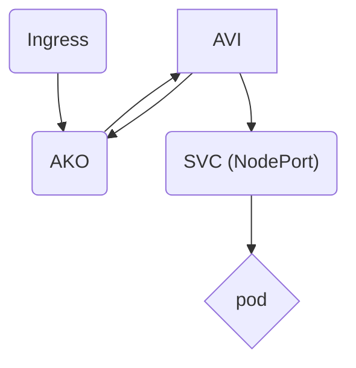

# Publisering

Publisering gjøres ved at ingress-definisjoner blir plukket opp av AKO som igjen opprettet nødvendig lastbalanserer og virtuelle publiseringer mot spesifisert nett.


!!! warning "Obs!"
    Per nå er det kun mulig å bruke port 80 og 443 på ingress, vi jobber med løsning som tillater flere porter.

For sette opp en publisering trengs som minimum en *Service* av type [`NodePort`][^3] og en [`ingress`][^1] med riktig [`ingressClassName`][^2].
AVI tilbyr egene CRD-er for ytterligere tilpasninger av en ingress, HostRule og HTTPRule, som muliggjør blant annet brannmurfiltrering og TLS offloading.

Støttede [`ingressClassName`][^2] er:


| ingressClassName | Tilgang fra | DNS | 
| --- | --- | --- |
| avi-ingress-class-helsenett | - helsenett<br>- nhn-datasenter<br>- alle klient og <br> servernett i helse-<br>forvaltningen| helsenett-dns* | 
| avi-ingress-class-internett | - internett | internett-dns |
| avi-ingress-class-datacenter | - nhn-datasenter<br>| helsenett-dns |

<pre><sub>* Det kan være behov for oppsett av conditional forwarders i nett som bruker ActiveDirectory for dns.</sub></pre>

Om man benytter ingress-class `avi-ingress-class-helsenett` for å publisere vil alle konsumenter på helsenettet nå publiseringen. Det vil si at alt på helsenettet kan spørre publiseringen. Ønsker man tilgjengeligheten av en helsenett ingress class, men med filtrering benyttes datascripts. Se `Brannmurfiltrering / Hvitelisting`


!!! tip "Tips"
    Det fungerer ikke å definere flere porter i en service eller ingress som skal publiseres.

## Brannmurfiltrering / Hvitelisting
For å begrense tilgjengligheten av en publisering benyttes en AKO-spesifikk CRD, HostRule, som bl.a. benyttes for å sette på [`datascripts`][^6]

| "Etats"-prefikser | Beskrivelse |
| ----- | ---- |
|btr|Bioteknologirådet|
|dsa|Direktoratet for strålevern og atomsikkerhet|
|ehelse|Direktoratet for e-Helse|
|eomb|Eldreombudet|
|fhi|Folkehelseinstituttet|
|hdir|Helsedirektoratet|
|helfo|Helseøkonomiforvaltningen|
|hk|Helseklage|
|htil|Helsetilsynet|
|nhn|Norsk Helsenett Sf|
|npe|Norsk Pasientskadeerstatning|
|pobo|Pasient- og brukerombudet|
|ptr|Pasientreiser|
|slv|Statens legemiddelverk|
|ukom|Statens undersøkelseskommisjon for helse- og omsorgstjenesten|


Følgende datascript kan benyttes for å tillate trafikk:

| datascript | beskrivelse |
| -------- | ------------ |
|expose-[etat]-office-any|Alle kontorsegmenter til kunde|
|expose-[etat]-office-client|Klientsone ute hos kunde|
|expose-[etat]-office-printer|Printsone hos kunde|
|expose-[etat]-office-video|Videosone hos kunde|
|expose-[etat]-office-iot|Eksponere virtuelle maskinen til alle kontor iot-segmenter hos kunden, f.eks Evoko møteromspanel, besøkssystem. Dette er en mindre restriktiv sone med mulighet for tilgang til internett.|
|expose-[etat]-office-lab|Kundens LAB-sone ute på kontorlokasjon|
|expose-[etat]-office-technical|Eksponere virtuelle maskinen til alle kontor tekniske-segmenter hos kunden, f.eks adgangskontrollsystem, temperaturfølere o.l.|
|expose-[etat]-office-devops|Utviklere ute hos kunde|
|expose-[etat]-office-nat|Enkelte kontorlokasjoner har ikke rutbare Helsenett-adresser, derfor blir disse adresseoversatt på vei ut til Helsenettet.|
|expose-[etat]-office-isp|Offentlige adresseområder på internett ; kan være aktuelt ved tilgjengeliggjøring av publiseringsløsninger over internett for en spesifikk kunde|
|expose-[etat]-dc-any|Alle spesifikke datasenter-adresseområder for en kunde|
|bottom-deny-rule|Drop regel som må legges til i bunnen av datascript konfigurasjon. Denne sørger for at uønsket trafikk stopper etter å ikke matche på øverige datascript.

Datascriptene inneholder logikk som matcher på ip-adresser på klient som forespør publisering. "expose-nhn-office-any" vil inneholde alle relevante subnett for klienter på kontorlokasjonene til Norsk Helsenett.

!!! warning "Obs!"
    På slutten av listen med datascript MÅ man legge på en drop regel. Om man ikke definerer drop regel vil man ikke droppe noe trafikk, og andre datascript for filtrering vil ikke ha noen effekt.


#### Eksempel av konfigurasjon:

```yaml
apiVersion: ako.vmware.com/v1alpha1
kind: HostRule
metadata:
  name: eksempel-hostrule
  namespace: default
spec:
  virtualhost:
    fqdn: eksempel.test.nhn.no
    datascripts:
    - expose-nhn-office-client
    - expose-htil-office-video
    - bottom-deny-rule


```

## TLS

For å sette opp tls automatisk må [`ingress`][^1] inneholde følgende:

- Annotation `cert-manager.io/cluster-issuer: [utsteder]`
    - Støttede utstedere er: `letencrypt-staging`, `letsencrypt-prod` 
- en gyldig [`tls`][^5] definisjon.

### TLS offloading

Hvis tjenesten kjører tls med f.eks. self-signed sertifikat og man ønsker rekryptering av trafikken må det enables en [`HTTPRule`][^4] som vist under:

```yaml
apiVersion: ako.vmware.com/v1alpha1
kind: HTTPRule
metadata:
  name: [name]
  namespace: [namespace]
spec:
  fqdn: [fqdn.nhn.no]
  paths:
  - target: /
    tls:
      type: reencrypt

```

#### Verifisere mot egen CA

For å verifisere sertifikatet på innsiden mot egen ca kan denne legges med i `tls` blokken i [`HTTPRule`][^4]

!!! warning "Obs!"
    Denne verdien vil ikke oppdateres dynamisk.

```yaml
destinationCA:  |-
        -----BEGIN CERTIFICATE-----
        [...]
        -----END CERTIFICATE-----
```
## HTTP Inspisering og Token Validering

HTTP inspisering og Token Validering er for øyeblikket ikke støttet i AKO.
<br>
Arbeid med å få det tilgjengeliggjort er pågående.

Ta kontakt med Driftsteam Datasenter Nettverk, fagområde Lastbalansering, ved spørsmål.


## Eksempel

### Ingress

```yaml
apiVersion: networking.k8s.io/v1
kind: Ingress
metadata:
  annotations:
    cert-manager.io/cluster-issuer: letsencrypt-staging
  name: [ingressname]
  namespace: [ingressnamespace]
spec:
  ingressClassName: avi-ingress-class-helsenett
  rules:
  - host: [fqdn]
    http:
      paths:
      - backend:
          service:
            name: [servicename]
            port:
              number: 80
        path: /
        pathType: ImplementationSpecific
  tls:
  - hosts:
    - [fqdn]
    secretName: [tls-secretname] # tjeneste-tls
---
apiVersion: v1
kind: Service
metadata:
  name: [servicename]
  namespace: [servicenamespace]
spec:
  ports:
  - name: http
    port: 80
    targetPort: 8080
  selector:
    app.kubernetes.io/name: [appselector]
  type: NodePort
---
apiVersion: ako.vmware.com/v1alpha1
kind: HostRule
metadata:
  name: [HostRule-name]
  namespace: [ingressnamespace]
spec:
  virtualhost:
    fqdn: [fqdn]
    datascripts:
    - [datascript-name]
    - bottom-deny-rule

```
[^3]: https://kubernetes.io/docs/concepts/services-networking/service/#type-nodeport
[^1]: https://kubernetes.io/docs/concepts/services-networking/ingress/
[^2]: https://kubernetes.io/docs/concepts/services-networking/ingress/#ingress-class
[^5]: https://kubernetes.io/docs/concepts/services-networking/ingress/#tls
[^4]: https://avinetworks.com/docs/ako/1.6/custom-resource-definitions/#HTTP
[^6]: https://avinetworks.com/docs/ako/1.6/custom-resource-definitions/#hostrule
